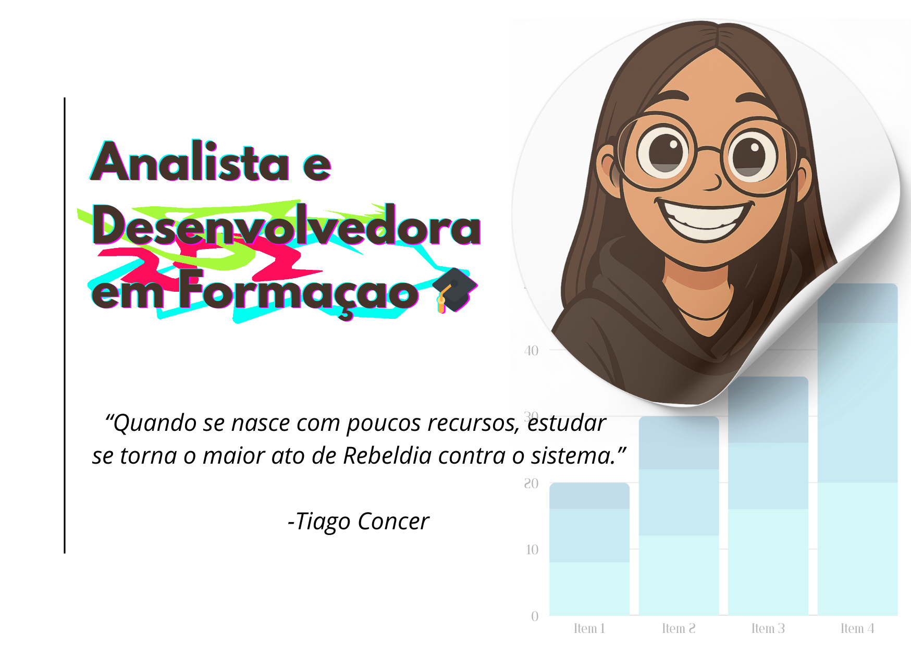

**_LUISA LAURA_**

  
  
  
  
  

- 📚 Estudante apaixonada por **Tecnologia e Desenvolvimento IA**  
- 💡 Sempre explorando novas ferramentas e frameworks  
- 🌍 Buscando contribuir em projetos **open-source**  
- 🚀 Focada em aprender e compartilhar conhecimento  

  
  

  
  
  

