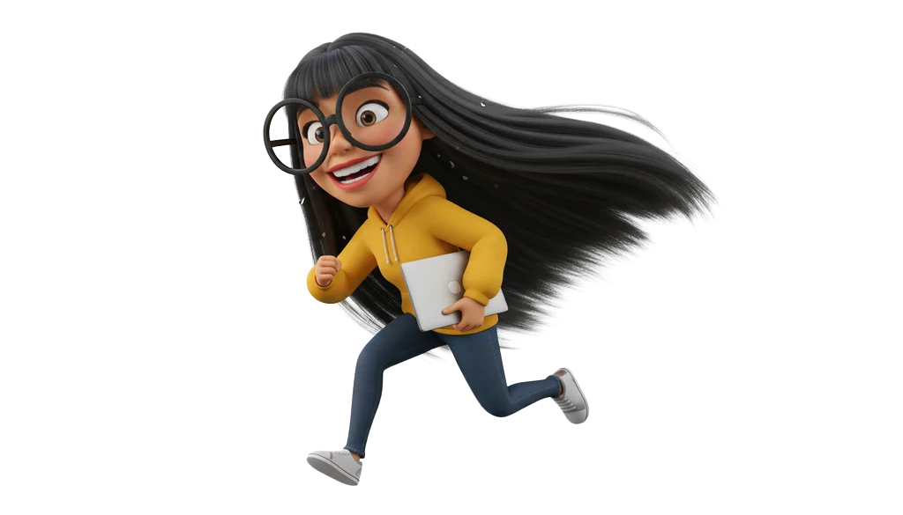

# Luisa Laura

## Suporte TI | Java Enthusiast | Redes & Quantum Computing Explorer

  
  

    <i>"Redes são a espinha dorsal de tudo que você usa sem perceber."</i>
  

---

  

  
  
   
  

- 👨‍💻 Analista Field - **Suporte Técnico**
- 🎓 Estudante de **Análise e Desenvolvimento de Sistemas**.
- 🛡️ Aprofundando em **Redes**.
- ⚛️ Pesquisando os fundamentos da **Computação Quântica** e como ela impactará a criptografia atual.
- 🤝 Voluntária dedicada e entusiasta de projetos que geram impacto social.

---
---

  
   
  

  
  

---

